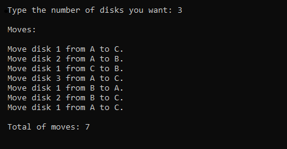

# Tower of Hanoi: the recursive solution.
**How many ways are there to solve the Tower of Hanoi problem?**

There are two common ways of thinking about how to solve the Tower of Hanoi problem using programming: either implementing the iterative version or the recursive version. 

**Then why should we use the recursive way in that problem?**

Actually, we could have done it by the iterative version. But, recursion may be very useful when we need to make a clear code, and generally it's more intuitive. The iterative version of Tower of Hanoi takes several lines of code while the recursive algorithm can give us the same result taking much less lines.

**Is the recursive way faster than the iterative one?**

It's not that simple to say if a recursive solution to an specific programming problem is faster or slower than the iterative solution of it. A lot of things must be considered. I recommend the reading of the following page for a better understandment:
[https://www.quora.com/Is-recursion-faster-than-loops]

**Screenshot:**

